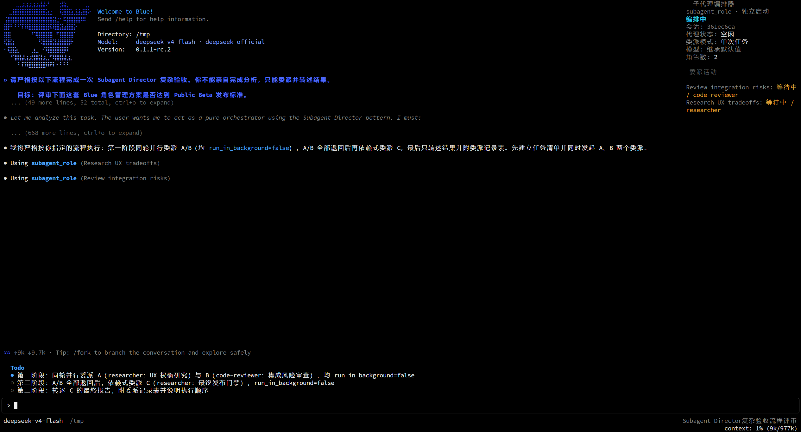

# Subagent Director x Blue Public Beta 联调

> 状态：本地协作实现，目标 Blue `0.1.1-rc.2` / protocol
> `1.0.0-beta.1`。当前不修改 Blue，不代表稳定版兼容承诺。

## 已实现

本分支保留原有 Host、Web bridge 和 React client，并新增一个独立的 Blue frontend：

- `/orchestrate on` 时显示只读 Director pane，`off` 时隐藏，窄终端自动移到底部；
- `/director` 打开中文角色管理 overlay，以左右键选择角色或 `+ 新建角色` tab，按 Enter 激活；
- 每个角色 tab 是可保存、删除的表单；
- pane 只显示当前 session、模型、委派配置、角色数和 Director activity；
- 角色保存/删除结果通知；
- canonical `blue.plugin.json`、`./blue` export 和 capability/resource 声明；
- Blue/Web/headless 三种宿主的独立生命周期。

Activity 数据由 Director Host 自有的 renderer-neutral snapshot 提供：Host 按当前
Agent 的既有 `tool/call` / `tool/result` 增量折叠，Blue frontend 只读取这个窄化
service，不读取 raw session events。Blue 通过 Public Beta `session.read` 确定当前
session，并订阅 owner 恢复后的 replay。仅在尚未拿到 identity 且 Host 恰好只有一个
非 subagent 根 Agent 时，Host 才采用该唯一根 Agent，不在多会话之间猜测。
`subagent_role` 的结果通过官方 `presentationMeta` 保存结构化
child/job/run id；模型可见 output 和原 Web render 文本没有变化，也不写新的自定义
activity event。

## 为什么不影响 Web

bundle 中三个 entry 各自拥有生命周期：

| Entry | 作用 | 非目标宿主行为 |
| --- | --- | --- |
| `dsh-plugin-subagent-director` | Host 工具、路由、activity snapshot、action service | 所有宿主正常运行 |
| `dsh-plugin-subagent-director/bridge` | Web settings HTTP bridge | 无 `webServer` 时由 child Fiber 等待 |
| `dsh-plugin-subagent-director/blue` | Blue 只读 pane、角色 overlay、command | 无 `bluePluginHost` 时由 child Fiber 等待 |

Blue entry 的运行时代码不导入 `@dsh-blue/*`；相关 import 全部是 TypeScript
type-only。因此只安装 Web profile 时，不会因缺少 Blue 包而发生模块加载失败。原有
React client 的 `dsh.client` 配置、remote route、settings section、model dock 和
close action 均未替换。

## 最快看到效果

下面是给项目维护者的主测试路径。它只创建一个 Blue profile，并把 fork checkout 以
`link:` 方式装进去，不修改 Blue 源码，也不发布任何 npm 包。

### 1. 准备环境

- Node.js `^22.19.0 || >=24.0.0`；
- Git；
- npm 可访问 npm registry。

安装 pnpm 和精确版本的 Blue，不能使用 `latest` 或浮动的 `rc` tag：

```bash
npm i -g pnpm@11
npm i -g @dsh-blue/blue-cli@0.1.1-rc.2
blue
```

第一次启动会初始化 `blue` profile。看到 Blue 主界面后输入 `/quit` 退出。

> 如果 npm 返回 `E404`，说明 `0.1.1-rc.2` 尚未发布，请等待该精确版本发布，不要换用
> 其他 Blue 版本测试这个分支。

### 2. 下载并构建插件

复制执行下面整段命令：

```bash
mkdir director-blue-preview
cd director-blue-preview

git clone https://github.com/dsh-blue/blue.git blue
git -C blue checkout 1b080a6f517020e4a1af78be684c1074e049d5e1

git clone https://github.com/dsh-blue/dsh-plugin-subagent-director.git subagent-director-blue
git -C subagent-director-blue switch blue-integration-p0

npm --prefix subagent-director-blue install
npm --prefix subagent-director-blue run build
```

最终目录应为：

```text
director-blue-preview/
  blue/
  subagent-director-blue/
```

同级 `blue/` 只用于提供 `0.1.1-rc.2` Public Beta 的编译期 TypeScript 类型；插件
不会修改或从该 checkout 启动 Blue。等 `@dsh-blue/blue-api@0.1.1-rc.2` 发布并将
devDependency 切换到 registry 版本后，这个临时步骤即可删除。

### 3. 安装插件并启动

仍在 `director-blue-preview/` 目录执行：

```bash
blue plugin add "link:$PWD/subagent-director-blue"
blue
```

成功启动时不应出现 `entry did not activate`、pending entry 或
`ERR_MODULE_NOT_FOUND`。Director pane 默认隐藏，这是正常状态。

### 4. 创建两个演示角色

1. 输入 `/director` 打开“角色管理”。
2. 用左右键选中 `+ 新建角色`，按 Enter 打开表单。
3. 按下面的字段创建并保存两个角色；供应商、模型和工具过滤可以留空。

| 角色 ID | 显示名称 | 职责描述 | 角色设定 |
| --- | --- | --- | --- |
| `researcher` | 研究分析员 | 调研明确的问题、比较证据并报告包含不确定性的结论 | 优先使用一手证据，区分事实与推断，并说明不确定性。 |
| `code-reviewer` | 代码审查员 | 审查正确性、回归风险、安全性、可维护性与测试缺口 | 按严重程度列出问题，引用具体证据，并区分阻塞项与改进建议。 |

保存后关闭角色管理，再次执行 `/director` 应能看到两个角色 tab。

### 5. 运行双角色委派演示

输入 `/orchestrate on`。宽终端右侧应出现只读“子代理编排器”面板；然后发送：

```text
请勿亲自分析。请在同一轮并行调用两次 subagent_role：
1. role=researcher，description="调研交互取舍"，分析左右键选择后 Enter 激活的优缺点；
2. role=code-reviewer，description="审查集成风险"，检查启动竞态、状态同步和 Web 回归风险；
两次调用都设置 run_in_background=false。等待两者完成后，只汇总它们的结论并列出剩余风险。
```

测试通过的判断：

- 模型确实调用了两次 `subagent_role`；
- “委派活动”出现“调研交互取舍”和“审查集成风险”两条记录；
- 两个子代理结果返回后，主代理只汇总结果；
- `/orchestrate off` 能立即隐藏状态面板，再次 `on` 能重新显示。



### 6. 后续重测或卸载

修改插件源码后，只需重新构建并重启：

```bash
npm --prefix subagent-director-blue run build
blue
```

如果改动了 `package.json`、`cordis.patch.yml` 或 `blue.plugin.json`，先重新执行
`blue plugin add "link:$PWD/subagent-director-blue"`。测试结束后可卸载：

```bash
blue plugin remove dsh-plugin-subagent-director
```

## 维护者自动验证

在上述双 checkout 布局中执行：

```bash
cd /absolute/path/to/director-blue-preview/subagent-director-blue
npm test
npm run typecheck
npm run build

node ../blue/script/blue-plugin-validate.mjs "$PWD"
npm pack --dry-run
```

预期结果：243 个测试通过；validator 报告 `valid: true`，并且
`manifest.discovered`、`manifest.valid`、`lifecycle` 均为 `true`。打包清单应包含
`blue.plugin.json`、`lib/blue-entry.js`、`lib/activity.js`、本文档和预览截图。

## 已知 UI 缺陷

这是供维护者评估交互方向的预览 UI，不是最终设计。`/director` 面板目前仍在调整：

- 窄终端会将放不下的角色 tab 折叠为 `+N`，信息可见性仍需优化；
- 长表单依赖内部滚动，焦点位置与滚动反馈仍可继续打磨；
- Public Beta 只在 Enter 激活后发送 `tab-change`，所以左右键移动不能立即换表单。

维护者可以选择不合并本 PR，也可以在现有 Host/API 接线基础上自行修改或替换 UI；
预览实现不要求项目接受当前视觉方案。

## 真人验收清单

### Blue TUI

1. 启动时没有 `entry did not activate` 或 pending entry，Director pane 默认不显示。
2. 执行 `/director`，确认出现角色 tabs；左右键选择现有角色或 `+ 新建角色`，按 Enter 后切换表单。
3. 每个现有角色显示一张完整表单；修改角色设定、模型供应商或模型后选择“保存”，再次打开确认值一致。
4. 在 `+ 新建角色` 新建角色，确认中文通知成功、tab 立即出现、`settings.yaml` 已持久化。
5. 删除测试角色，确认需要二次确认，随后 tab 消失。
6. 执行 `/orchestrate on`，确认宽终端右侧出现只读 Director pane；其中没有 tabs、选择项或操作按钮。
7. 让模型调用 `subagent_role`，确认 pane 的“委派活动”区出现任务说明、角色和状态。
8. 执行 `/orchestrate off`，确认 pane 隐藏；再次 on 后恢复显示。
9. 窄终端 on 时 pane 移到底部且文字不重叠，off 时不占布局空间。
10. 用 `/quit` 退出，再以同一条普通委派 session 执行 `--resume`，确认 Activity 从 session log 重建。

建议至少检查 `120x36`、`80x28`、`40x24` 三种终端尺寸。

### Web 回归

在独立 Web profile 用同一 checkout 安装并启动：

1. 启动时 Blue entry 不应 pending，也不应报 `@dsh-blue/*` 模块缺失。
2. 原 Subagent Director 设置页可打开，角色 CRUD 正常。
3. 修改角色后 Host 热更新正常。
4. 子代理模型 dock 和 Web close action 正常。
5. `/subagent-director` bridge route 随 Web 启动挂载，profile 退出时清理。

### Headless 回归

启动普通 headless profile，确认：

- Host delegation 工具正常注册；
- Web bridge 和 Blue frontend 的外层 entry 均为 ACTIVE；
- 它们各自的可选 child Fiber 等待宿主服务，不阻塞启动或退出。

## Public Beta 边界

当前仍不能实现的是接入 Blue 原生 agents pane/tool presentation。Blue Public Beta
catalog 没有第三方 tool-presentation 或 conversation-extension capability，现有 agents
事实提取也只理解内置 `subagent` / `subagent_fork`。本实现因此使用独立 Director
pane，不在 Blue 仓库硬编码可配置的 `subagent_role` 工具名。

### Blue API/renderer 待补能力

Public Beta 的 tabs 仅在用户按 Enter 激活后向插件发送 `tab-change`；左右键移动的
只是 renderer 内部焦点，插件收不到焦点变化事件，也没有“焦点即激活”的声明选项。
因此当前交互必须是“左右键选择、Enter 切换表单”。若要做到左右键移动时立即切换，
Blue 后续需要补充 tab focus-change 事件或等价的 activate-on-focus 契约，插件再据此
刷新 active tab。这是已记录的 API/renderer 能力缺口，不通过修改 Blue 私有实现绕过。

另外还有三个非功能阻塞：

- Marketplace 一键安装属于后续生态阶段，本地用 `link:` 安装；
- API 仍为 Public Beta，Blue 后续版本可能要求迁移 manifest/API；
- one-shot background 的 activity 只能确认 job 已委派，当前 snapshot 不冒充 job
  已完成状态；Blue pane 刻意保持只读。continuable child 仍可通过项目原有的
  `close_subagent` 工具释放，Web 会话页原有 Release action 保持不变。

恢复测试还有一个项目既有边界：写入过 `/orchestrate` 的 session 当前不能可靠
resume，Harness 可能在插件注册 `orchestrate/change` 事件类型之前校验日志并报告
unknown event。普通 `subagent_role` 委派 session 可以恢复。真人验收第 10 项必须使用
未执行过 `/orchestrate` 的 session；该限制不应被 Blue 适配文档掩盖。

## 希望作者确认

1. 由 `/orchestrate on|off` 控制只读 Director pane 显隐，是否符合项目的运行期产品意图？
2. Blue 角色表单当前编辑核心字段并保留既有 `toolFilter`，是否应在下一步加入完整
   allow/deny 工具选择器？
3. Host activity snapshot 基于现有 tool events 和 `presentationMeta`，不新增 session
   event，这个持久化边界是否合适？
4. 是否认可 Web bridge、Blue frontend 都采用“外层 entry 正常激活 + child Fiber
   等待宿主能力”的对称生命周期？
